# System Workflows

## Overview

This document details the key workflows in the Agentic Engineering Memory System, showing how data flows through the system and how different components interact.

## 1. Ingestion Workflow

### GitHub PR Ingestion

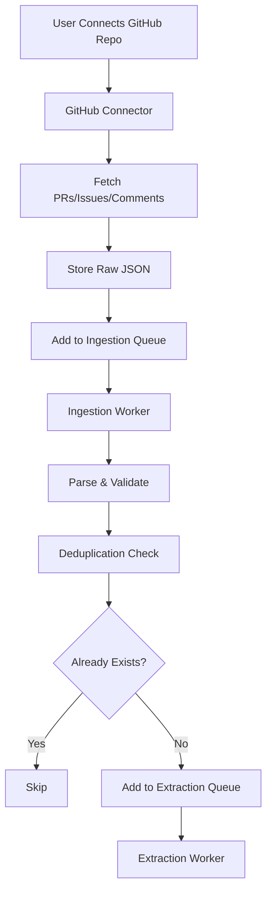

### File Upload Ingestion

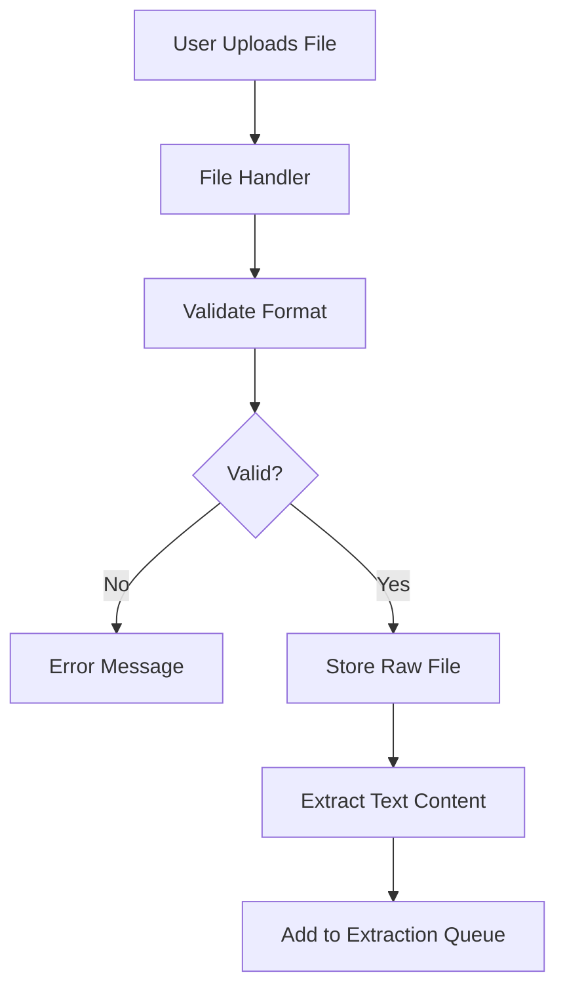

## 2. Extraction Workflow

### Decision Extraction

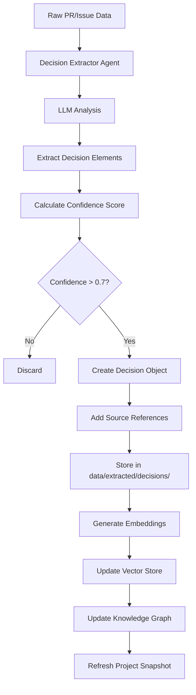

### Multi-Agent Extraction Pipeline

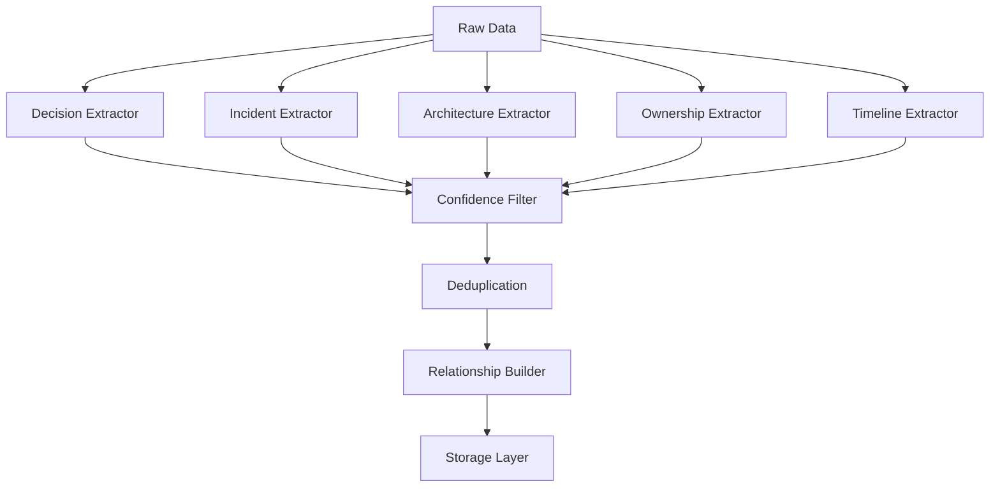

## 3. Query Workflow

### Dynamic Query Orchestration (LangGraph)

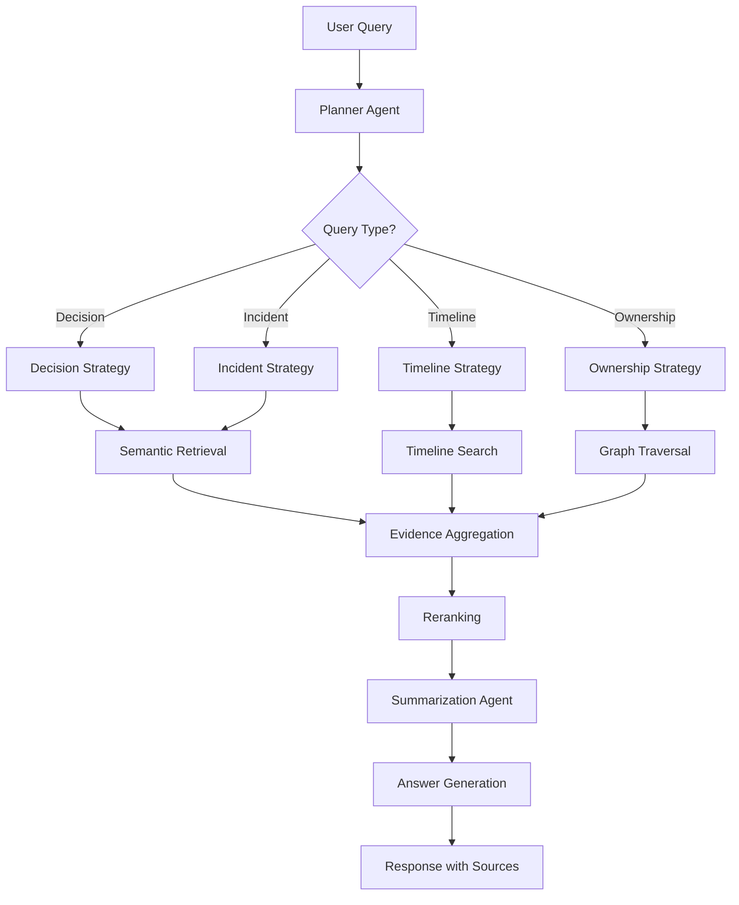

### Retrieval Strategies

#### Semantic Search
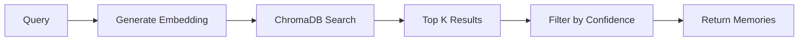

#### Graph Traversal
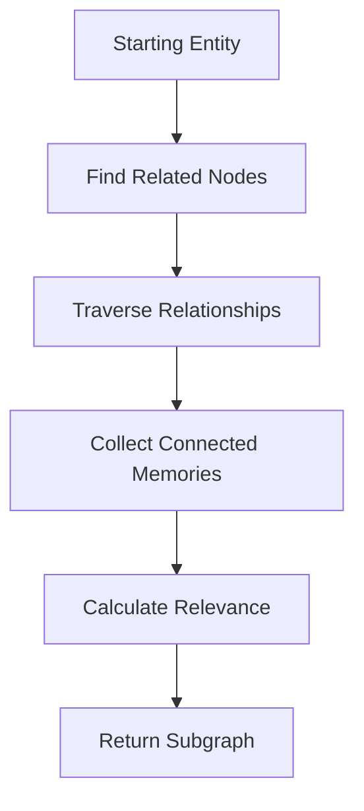

#### Hybrid Retrieval
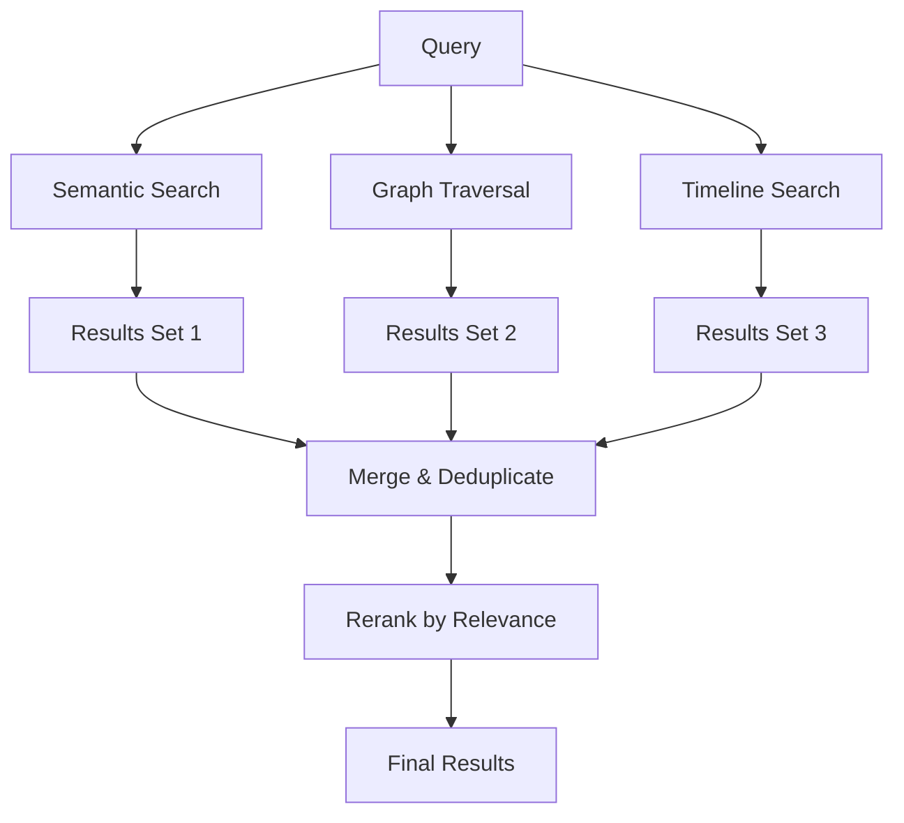

## 4. Background Processing Workflow

### Async Worker Architecture

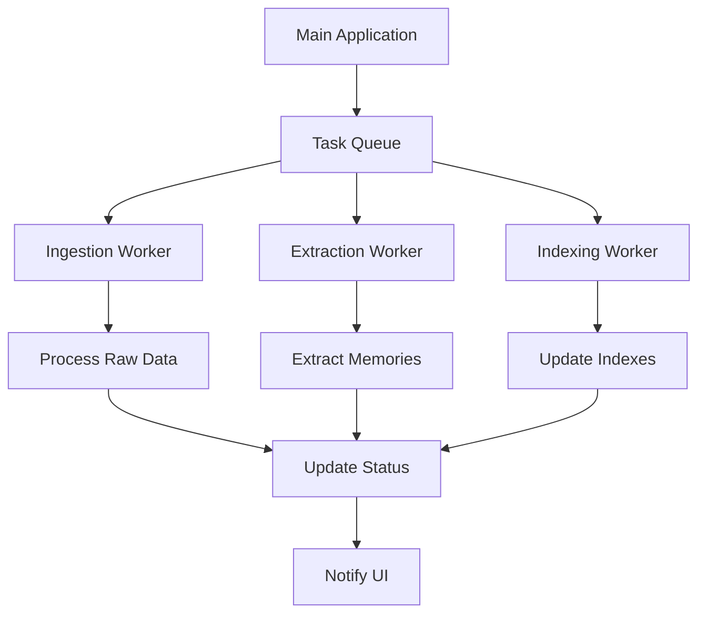

### Resumable Processing

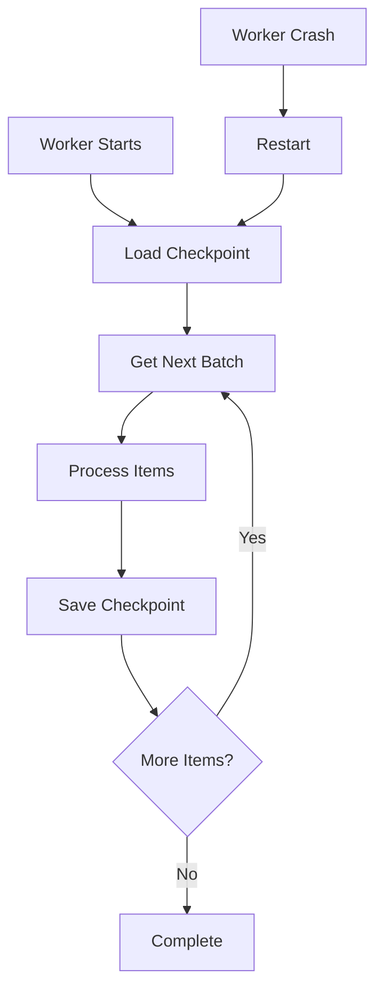

## 5. Memory Update Workflow

### Knowledge Graph Update

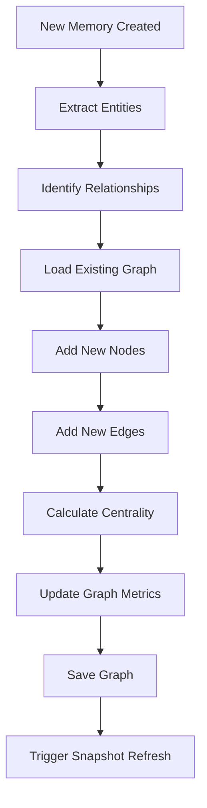

### Snapshot Generation

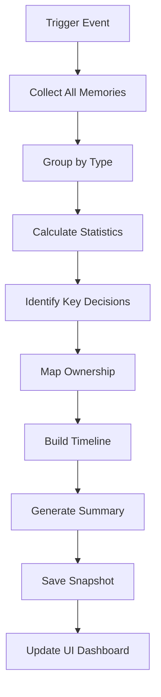

## 6. Deduplication Workflow

### Semantic Deduplication

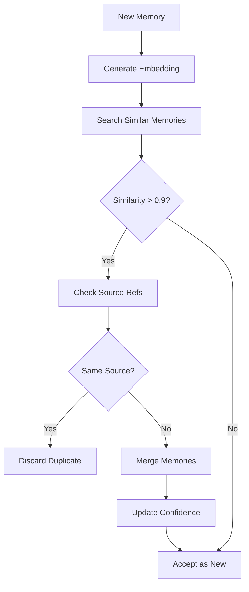

## 7. Confidence Scoring Workflow

### Multi-Factor Confidence

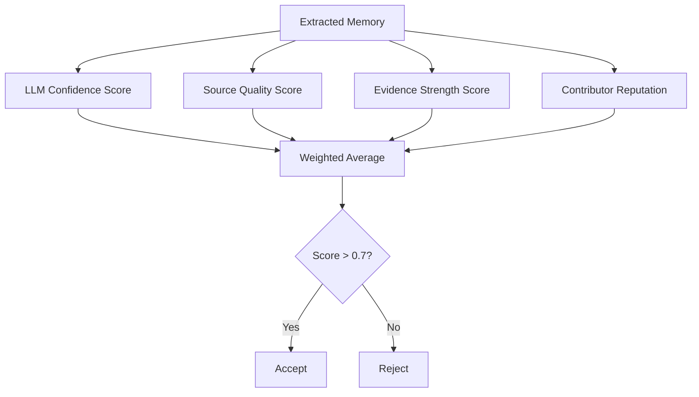

## 8. Timeline Construction Workflow

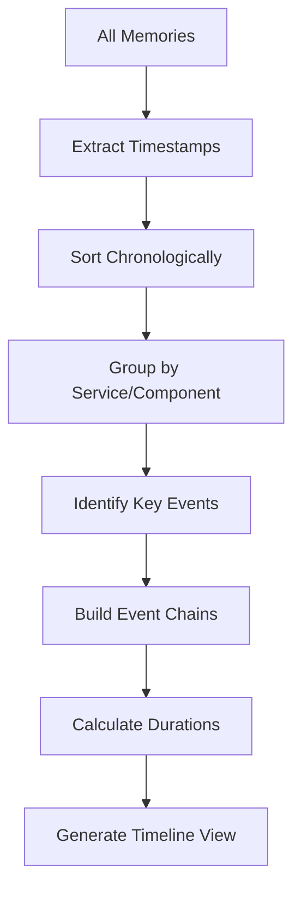

## 9. Relationship Building Workflow

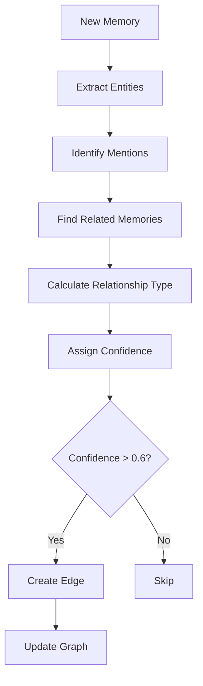

## 10. Error Handling Workflow

### Graceful Degradation

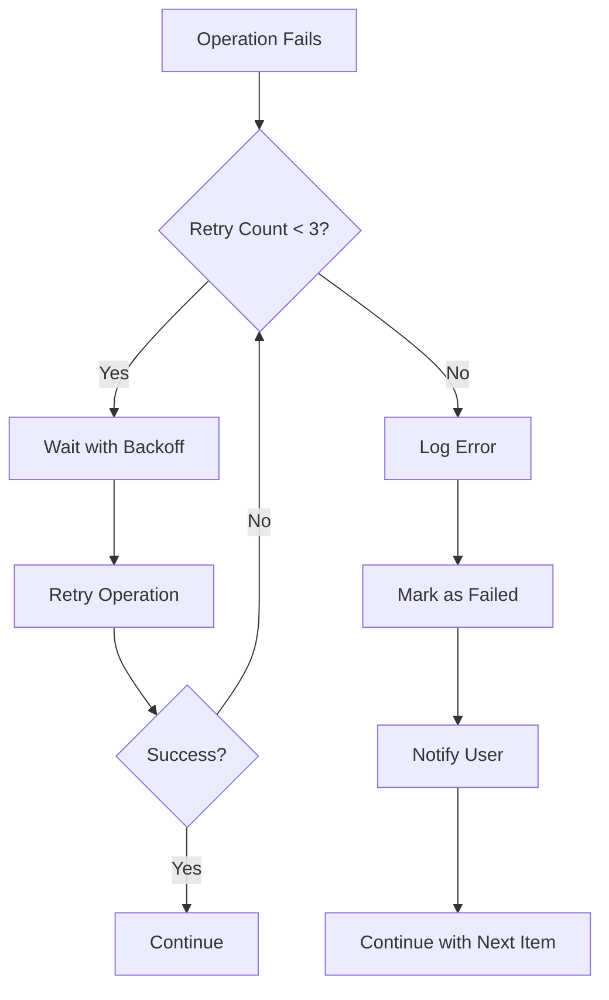

## Key Workflow Principles

### 1. Async-First
- All heavy operations are async
- User never waits for processing
- Background workers handle load

### 2. Resumable
- Checkpoints at each stage
- Can restart from failure point
- No data loss on crash

### 3. Incremental
- Process in batches
- Update incrementally
- No full reprocessing needed

### 4. Observable
- Status updates at each stage
- Progress tracking
- Error visibility

### 5. Idempotent
- Safe to retry operations
- Deduplication prevents duplicates
- Consistent state

## Workflow States

### Ingestion States
- `queued` - Waiting to be processed
- `processing` - Currently being ingested
- `completed` - Successfully ingested
- `failed` - Error occurred
- `skipped` - Duplicate detected

### Extraction States
- `pending` - Waiting for extraction
- `extracting` - LLM processing
- `validating` - Confidence check
- `accepted` - Passed validation
- `rejected` - Failed validation

### Memory States
- `draft` - Initial extraction
- `validated` - Confidence checked
- `indexed` - Added to vector store
- `graphed` - Added to knowledge graph
- `active` - Available for retrieval

## Performance Considerations

### Batch Processing
- Process 10 items per batch
- Parallel extraction agents
- Async I/O operations

### Caching
- Cache embeddings
- Cache graph queries
- Cache LLM responses (where appropriate)

### Optimization
- Lazy loading of large graphs
- Pagination for results
- Incremental indexing