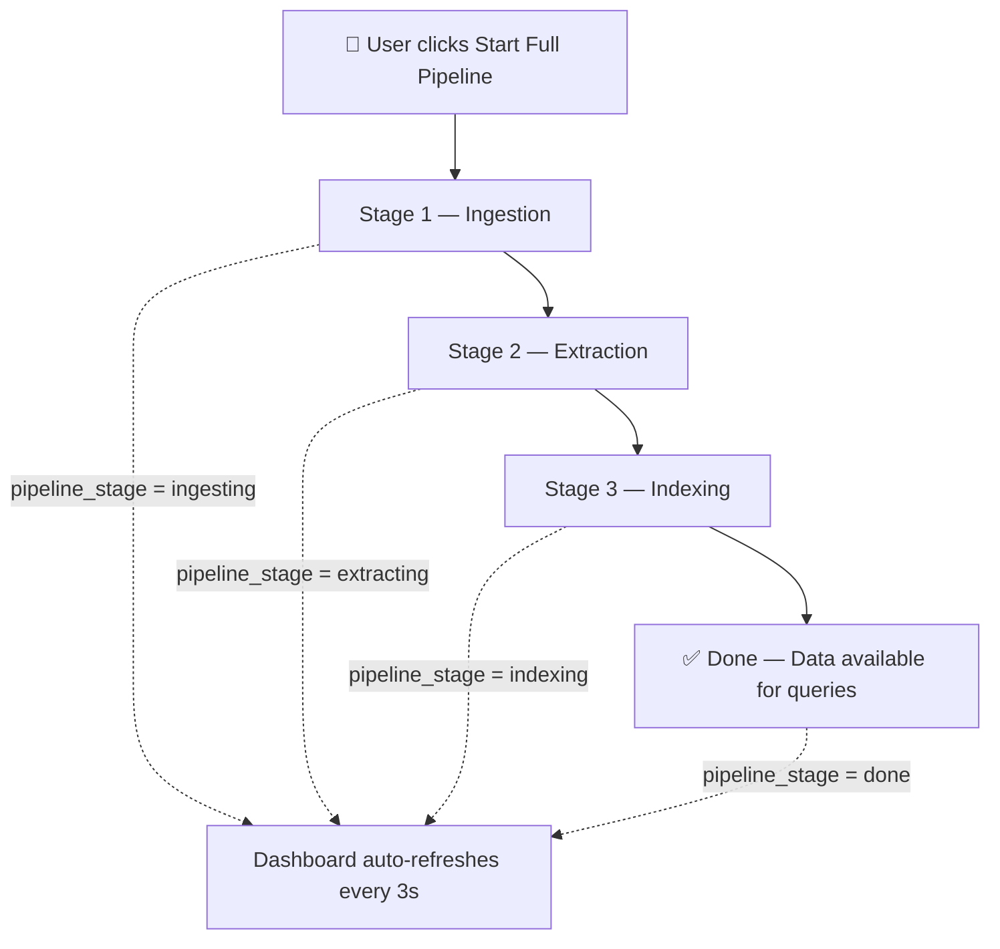
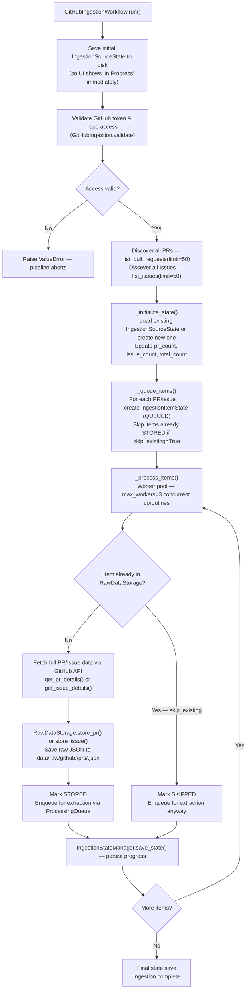
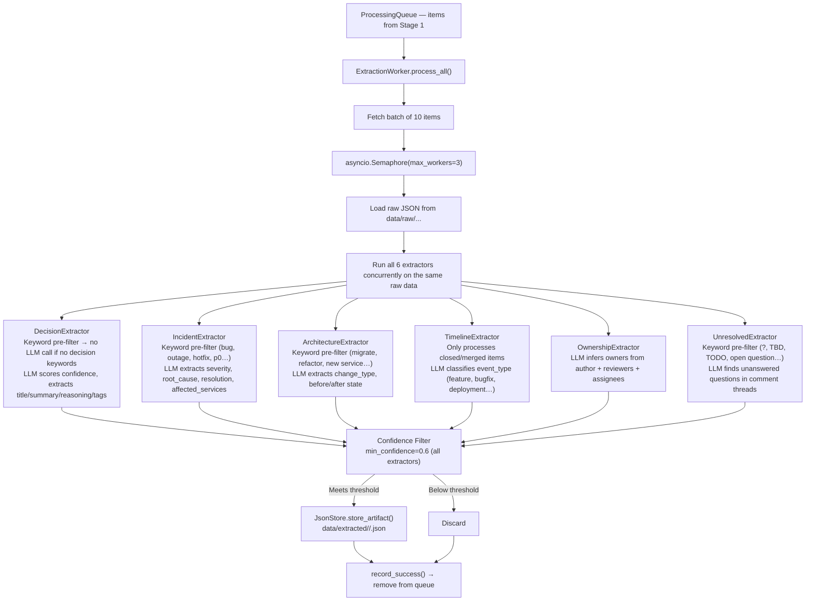
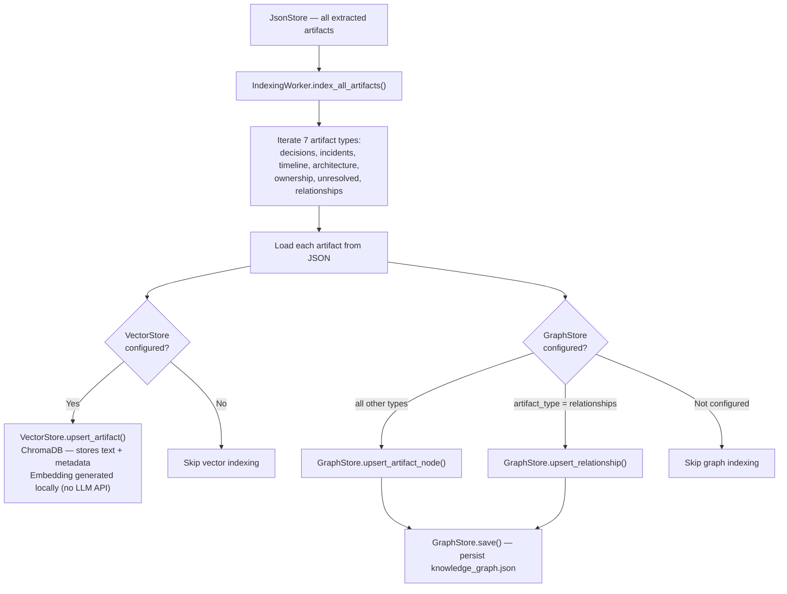
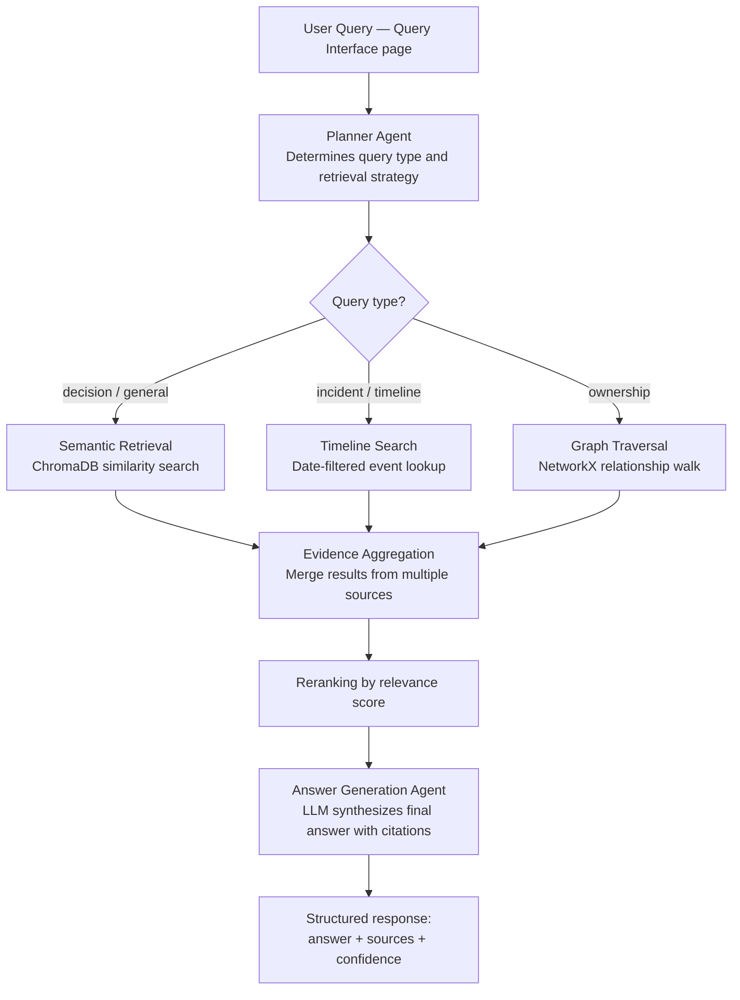
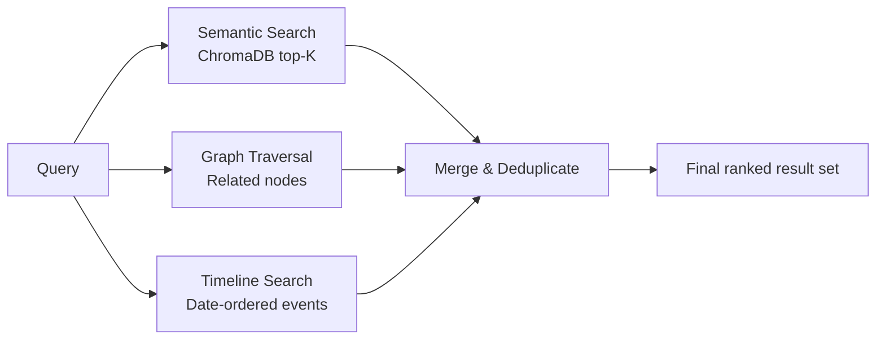
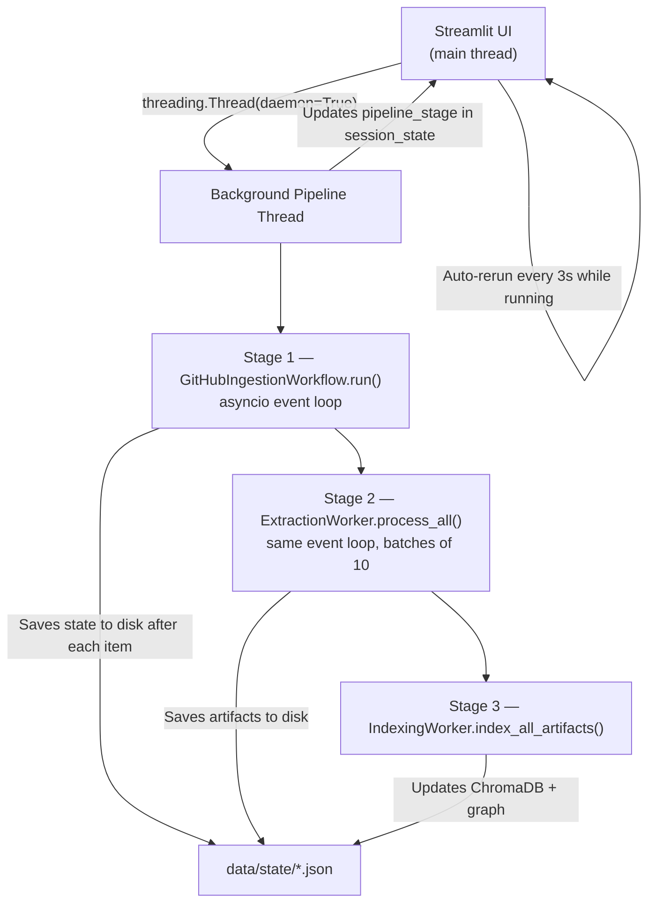
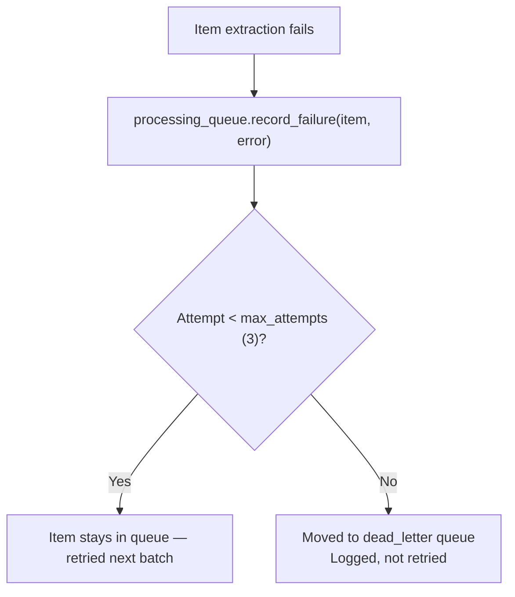
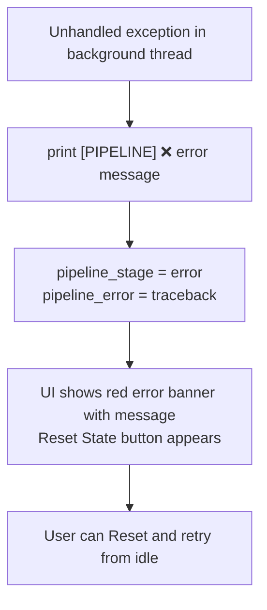
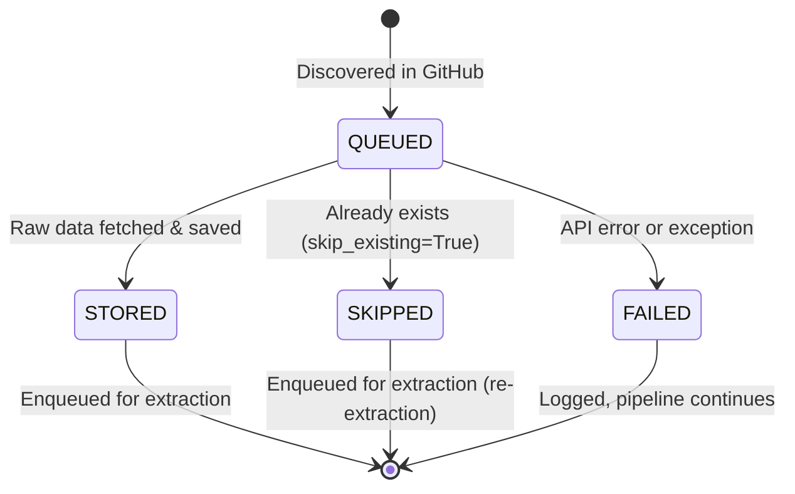

# System Workflows

## Overview

This document describes the actual data flow through the Agentic Engineering Memory System as it is implemented today. It covers the three-stage automated pipeline (Ingest → Extract → Index), query orchestration, error handling, and key design principles.

> **LLM Usage Summary**
> | Stage | Uses LLM? | Notes |
> |---|---|---|
> | Stage 1 — Ingestion | ❌ No | Pure GitHub API, PyGithub, async I/O |
> | Stage 2 — Extraction | ✅ Yes | Each extractor calls the configured LLM (Gemini / Groq / Watsonx) |
> | Stage 3 — Indexing | ❌ No | ChromaDB's built-in embedding model; no LLM API key needed |
> | Query Interface | ✅ Yes | LangGraph orchestration uses the configured LLM |

---

## 1. Automated Pipeline (One-Click)

The Processing Dashboard triggers all three stages sequentially in a background thread. The user presses a single button and the pipeline proceeds autonomously.



---

## 2. Stage 1 — GitHub Ingestion Workflow

**Entry point:** `app/ingestion/github/workflow.py` → `GitHubIngestionWorkflow.run()`



**Data written:**
- `data/raw/github/<owner>_<repo>/prs/<number>.json`
- `data/raw/github/<owner>_<repo>/issues/<number>.json`
- `data/state/<source_id>.json` — ingestion progress state
- `data/state/processing_queue.json` — handoff records for Stage 2

**Rate limiting:** Token bucket limiter — 100 requests / 60 seconds. All GitHub API calls go through `RateLimiter.acquire()`.

---

## 3. Stage 2 — LLM Extraction Workflow

**Entry point:** `app/workers/extraction_worker.py` → `ExtractionWorker.process_all()`

Each item from the processing queue is passed through **all 6 extractors in parallel**. Each extractor independently decides whether the PR/Issue contains its artifact type.



**LLM invocation pattern used by all extractors:**
1. Quick keyword pre-filter (no LLM cost if PR is clearly irrelevant)
2. Build a structured prompt with title, description, labels, comments
3. `await llm.ainvoke(prompt)` → parse JSON response
4. Validate confidence ≥ threshold → create typed model object

**Terminal output during extraction:**
```
[EXTRACT] 🔍 IncidentExtractor → LLM analyzing: Fix critical auth timeout in prod
[EXTRACT] ✅ Incident found: Fix critical auth timeout in prod
[EXTRACT] 📅 TimelineExtractor → LLM analyzing: Add dark mode support
[EXTRACT] ✅ Timeline event: [feature] Add dark mode support
```

**Data written:**
- `data/extracted/decisions/<id>.json`
- `data/extracted/incidents/<id>.json`
- `data/extracted/timeline/<id>.json`
- `data/extracted/architecture/<id>.json`
- `data/extracted/ownership/<id>.json`
- `data/extracted/unresolved/<id>.json`

---

## 4. Stage 3 — Indexing Workflow

**Entry point:** `app/workers/indexing_worker.py` → `IndexingWorker.index_all_artifacts()`

No LLM is used here. ChromaDB uses its own local embedding model (all-MiniLM-L6-v2).



**Data written:**
- `data/embeddings/chroma/` — ChromaDB persistent files
- `data/graph/knowledge_graph.json` — NetworkX graph as JSON

---

## 5. Query Workflow (LangGraph Orchestration)

**Entry point:** `app/orchestration/graph.py`



### Hybrid Retrieval (within a single query)



---

## 6. Background Worker Architecture

All pipeline stages run in a **daemon thread** spawned by the Streamlit UI. The UI polls `st.session_state.pipeline_stage` every 3 seconds and updates the progress display.



**State machine:**

```
idle → ingesting → extracting → indexing → done
                                         ↘ error (any stage failure)
```

---

## 7. Error Handling

### Per-item failure (Extraction)



### Pipeline-level failure



### LLM unavailability

If LLM credentials are not configured:
- Each extractor calls `llm_config.validate_llm_ready()` before invoking LLM
- If not ready → logs a warning, returns `[]` (no artifacts extracted)
- Pipeline continues — ingestion and indexing still complete successfully
- **Extraction artifacts will simply be empty until LLM is configured**

---

## 8. LLM Provider Configuration

The system supports three providers, selected in the **Setup page** and stored in `.env`:

| Provider | Env var | Model default |
|---|---|---|
| Gemini | `GEMINI_API_KEY` | `gemini-1.5-flash` |
| Groq | `GROQ_API_KEY` | `llama3-8b-8192` |
| Watsonx | `WATSONX_API_KEY` + `WATSONX_PROJECT_ID` | configurable |

Provider is lazy-imported — only the selected provider's SDK is loaded when the LLM is first called.

---

## 9. Data Stores & Their Roles

| Store | Path | Technology | Used in stage |
|---|---|---|---|
| Raw storage | `data/raw/` | Plain JSON files | Written in Stage 1, read in Stage 2 |
| Extracted artifacts | `data/extracted/` | Plain JSON files | Written in Stage 2, read in Stage 3 |
| Ingestion state | `data/state/<source_id>.json` | JSON via `IngestionStateManager` | Written throughout Stage 1 |
| Processing queue | `data/state/processing_queue.json` | JSON via `ProcessingQueue` | Written in Stage 1, consumed in Stage 2 |
| Vector store | `data/embeddings/chroma/` | ChromaDB (persistent) | Written in Stage 3, queried at runtime |
| Knowledge graph | `data/graph/knowledge_graph.json` | NetworkX → JSON | Written in Stage 3, queried at runtime |

---

## 10. Ingestion Item Lifecycle



---

## 11. Key Design Principles

### 1. Async-First
- All I/O-heavy operations use `asyncio` (GitHub API, LLM calls, file reads)
- Worker pool controlled via `asyncio.Semaphore(max_workers=3)`
- UI thread never blocks

### 2. Fault Tolerant
- Initial state written to disk before any GitHub API calls so the UI always knows ingestion has started
- Per-item try/except — one bad PR never kills the batch
- LLM extractor failure falls through to the next extractor gracefully

### 3. Resumable
- `IngestionSourceState` is saved after every item processed
- Re-running the pipeline with `skip_existing=True` skips already-fetched items
- Queue uses a dead-letter mechanism — failed items don't block the queue

### 4. Keyword Pre-filtering (Cost Control)
- All LLM extractors run a lightweight keyword check before calling the LLM
- Only PRs with relevant signals (e.g., "incident", "migrate", "?", etc.) trigger an API call
- Trivial PRs (typo fixes, dependabot bumps) are filtered without any LLM cost

### 5. Observable
- All pipeline stages print `[PIPELINE]` and `[EXTRACT]` prefixed log lines to stdout
- Streamlit dashboard auto-refreshes every 3s and shows stage progress
- Ingestion metrics (stored/skipped/failed counts) visible in real time

### 6. Idempotent
- Re-running with the same repo is safe — items already stored are skipped
- `JsonStore.store_artifact()` overwrites by artifact ID — no duplicates
- ChromaDB uses `upsert` — re-indexing the same artifact is safe